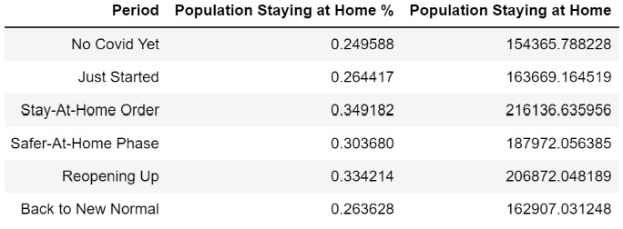
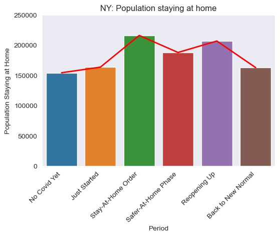

# Blog2
# How many people stay at home during pandemic and how far do people travel - Finding answers using Data Science skills

By Jasmine Huang posted on 12/04/2022

If you are reading my blog, congratulations to you that you have survived the pandemic of Covid-19!  Our lives have changed so much in the past 2 years. Each of us could write a book to share some of the unforgettable personal experiences.

If Covid-19 never happened, I would be attending the data science bootcamp at Flatiron school Denver campus in person.  During pandemic, all schools were shut down for a long period of time.  People were encouraged to work from home if possible.  Students were forced to learn from home virtually.  2 years later, Covid-19 is still active but not as deadly as it was before.  The whole world is trying to recover from the damages.  We are learning to live with it and have adopted  a new lifestyle.  Thus, I am attending the bootcamp virtually and enjoying the benefits of it.  Can’t stop telling you how much I hate driving in winter time.  If I have to commute to school 5 days a week, all the stress from driving in snow cumulatively would definitely shorten my life expectancy!

It is a new world after pandemic and I am a new me with data science skills learned from Flatiron school.  With the new ability, now I can find answers to my questions supported by statistical evidence. As I mentioned previously, I don’t enjoy driving in snow.  In fact, I don’t enjoy driving in traffic either.  During pandemic, two things I appreciated the most were the very light traffic and very comfortable personal space while shopping at Costco.  Courisly, I have always wondered how many people actually stayed at home, and did people travel less?
 
Colorado governor announced the stay-at-home order effected on 03/26/2020 and expired on 04/26/2020 followed by an extension phase of safer-at-home stated on 4/27/2020 and ended on 07/01/2020. The graph below shows the population staying at home between 2019/01/01 and 2022/02/05. The population staying at home does change through time, and the highest peak falls in the period of time while stay-at-home order is in place.

Unquestionably, more people are staying at home due to the state order.  We need to dive into the data a little further.  What’s the percentage of people staying at home and how much does it increase?

# Colorado

Firstly, here is the definition of 6 different periods of time for Colorado used in this research followed by some  visualization of its population staying at home :
No Covid: 2019/01/01 - 2019/12/31
Just started: 2020/01/01 - 2020/03/25
Stay-at-home order: 2020/03/26 - 2020/04/26
Safer-at-home phase: 2020/04/27 - 2020/07/01
Reopening up: 2020/07/02 - 2020/12/31
Back to new normal: 2021/01/01 - 2022/02/05

Quantitatively speaking, more people stayed at home willingly after Covid started spreading even after stay-at-home order had been lifted. However, if we look at the percentages of the population staying at home, the difference between the highest peak, “Stay-At-Home Order, and the time period before Covid, “No Covid Yet”, is around 10%.  With stay-at-home order executed, the percentage of the population staying at home only increased by 10%.

The degree of increasing in the percentage seems low.  Why?  Do people ignore the state order?  We could dig into the data, and maybe more data will be needed, to search for scientific answers.  Conveniently, we don’t need to work that hard for some straight and simple answers.  Practically speaking, NOT everyone could stay at home.  Most people still need to go to work especially for those who serve in public or retail.  Sincerely gratitude to those heroes who risk their life by going to work to keep our society from collapsing in the past 2 years.    

Now we have learned about the population staying at home during pandemic in Colorado.  How about other states?  Because not every state has amended a stay-at-home order, we can’t compare all the states.  From states who have announced stay-at-home orders, I randomly picked out 3 states to compare along with Colorado, and they are Kentucky, New York and Illonis.  Below provides the same visualization representing their population staying at home.

# Kentucky

The definition of 6 different periods of time for Kentucky used in this research:
No Covid: 2019/01/01 - 2019/12/31
Just started: 2020/01/01 - 2020/03/25
Stay at home order: 2020/03/26 - 2020/05/11
Safer at home phase: 2020/05/12 - 2020/07/17
Reopening up: 2020/07/18 - 2020/12/31
Back to new normal: 2021/01/01 - 2022/02/05

# New York

The definition of 6 different periods of time for New York used in this research:
No Covid: 2019/01/01 - 2019/12/31
Just started: 2020/01/01 - 2020/03/19
Stay at home order: 2020/03/20 - 2020/05/15
Safer at home phase: 2020/05/16 - 2020/07/21
Reopening up: 2020/07/22 - 2020/12/31
Back to new normal: 2021/01/01 - 2022/02/05

# Illinois

The definition of 6 different periods of time for Illinois used in this research:
1 No Covid: 2019/01/01 - 2019/12/31
2 Just started: 2020/01/01 - 2020/03/19
3 Stay at home order: 2020/03/20 - 2020/05/30
4 Safer at home phase: 2020/05/31 - 2020/08/05
5 Reopening up: 2020/08/06 - 2020/12/31
6 Back to new normal: 2021/01/01 - 2022/02/05

# Compare 4 states with one-way ANOVA test

The question is, do these 4 states have the same percentage of population staying at home during stay-at-home order period.  To answer the question, one-way ANOVA test is used in this research as the testing method.  The null hypothesis would be, all 4 states have the same mean of population staying at home. 

After running the F_oneway test, a fairly small p value is returned (p value = 3.99175e-52 ).  Therefore, the null hypothesis is rejected.  The percentage of population staying at home in different states varies. 

From the table below, we can double check and confirm the conclusion made from F-oneway test as well.  New York has the highest mean as 34.8% and Kenturky has the lowest mean as 25.9%.  The means of 4 different states are NOT equal. 

# Another fun finding! 

While stay-at-home order was in place, people were only allowed to leave for essential businesses or activities such as doctor visits, work, grocery shopping, etc.. Re-jogging the memory, some of the items in grocery stores were out of stock for quite a while.  People had to visit a few different stores to hunt for a few rolls of toilet paper or a bag of flour.  I was so worried about what if I was caught by the police for going too far away from my house.  Now that I have the data available, I could actually calculate the probabilities of some scenarios.  What is the probability that I talk to a random person who has traveled between 10 and 25 miles away from home during stay-at-home order period?  

During stay-at-home order period, the probability of not staying at home is 0.68, and the probability of traveling between 10 and 25 miles away from home is 0.14.

p_10_25 = 0.14
p_not_home =  0.68

p(outcome) = p_not_home * p_10_25 = 0.0952

Outcome: The probability that I talk to a random person and the person has traveled between 10 and 25 miles away from home during stay-at-home order period is 9.52%.

# Research Detail and Limitations

For details regarding this research, please see the notebook loaded in my GitHub, or visit the original data resource listed in References.

With the large data given, the original data provider is confident to say the data can strongly represent the actual population.  Hence we use the term “population” rather than “sample” in this research.

Outliers are spotted in scatter plots.  Based on the assumption and model setting in future research, outliers should be treated in a proper way to avoid its influence in outcome. 

The biggest challenge and limitation in this research is each state has different laws,  regulations and culture.  It’s impossible to place all 50 states in this particular model since some states didn’t execute a stay-at-home order.  For states with stay-at-home orders, their orders are not uniformed.  Each order has some differences in detail.  The only unbiased factor would be “time”.  For further research, we could probably set up a testing model by slicing the dates on the same time frame, and put all 50 states to the test.      

# References

- Data resource: Trips by Distance - Catalog (data.gov)
- Stay-At-Home Orders to Fight COVID-19 in the United States: The Risks of a Scattershot Approach | KFF
- Statewide COVID‐19 Stay‐at‐Home Orders and Population Mobility in the United States - PMC (nih.gov)
- Timing of State and Territorial COVID-19 Stay-at-Home Orders and Changes in Population Movement — United States, March 1–May 31, 2020 | MMWR (cdc.gov)
- See Which States and Cities Have Told Residents to Stay at Home - The New York Times (nytimes.com)
- Stay at Home Order Expiration Dates (piworld.com)
- https://www.westword.com/news/colorado-covid-two-year-timeline-13622700
- https://www.mercercountypa.gov/dps/state_fips_code_listing.htm
- ANOVA using Python (with examples) (reneshbedre.com)
- https://www.littler.com/publication-press/publication/stay-top-stay-home-list-statewide

